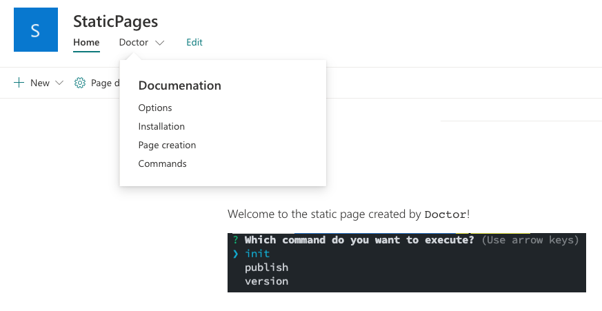

<h1 align="center">
  
</h1>

<h2 align="center">Doctor Sample Project</h2>

This is a sample project to show how [doctor](https://github.com/ValoIntranet/doctor) can be used.

## Usage

- Clone this repository: `git clone https://github.com/ValoIntranet/doctor-sample`
- Install `doctor`: `npm i -g @valo/doctor`
- Create a `doctor.json` file (the provided sample can be used)
- Run: `doctor publish`

This should create the following structure in your site:

