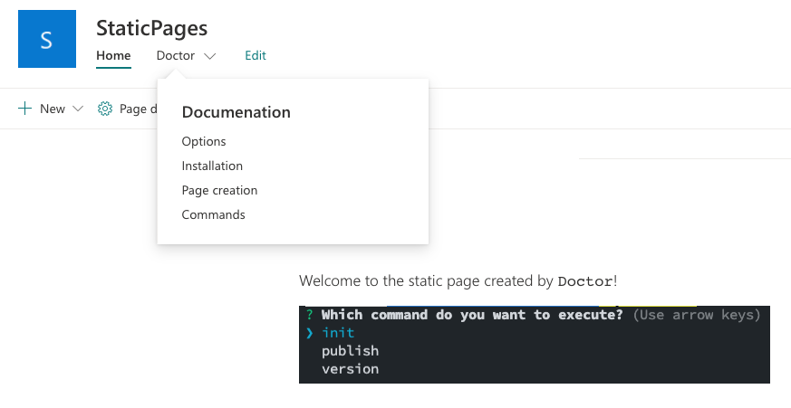

<h1 align="center">
  <a href="https://github.com/estruyf/doctor-sample">
    
  </a>
</h1>

<h2 align="center">Doctor Sample Project</h2>

This is a sample project to show how [doctor](https://getdoctor.io) can be used, and to test it: the
pages under `src/tests` each exercise a part of what `doctor` does.

## Usage

1. Clone this repository: `git clone https://github.com/estruyf/doctor-sample`
2. Install `doctor`: `npm i -g @estruyf/doctor` — or `@estruyf/doctor@next` to test what is not
   released yet
3. Copy `doctor.sample.json` to `doctor.json`, and fill in `url`, `appId`, `tenant` and
   `certificate` (the path to your `.pfx` file, or its base64 contents). `doctor.json` is ignored by
   Git, so it stays on your machine. See
   [certificate authentication](https://getdoctor.io/docs/getting-started/certificate-authentication/)
   for setting up the app registration.
4. [Prepare your site](#prepare-your-site) for the test pages which need it
5. See what will happen: `doctor status`
6. Publish: `doctor publish`

When your certificate has a password, `doctor` asks for it — the input shows as dots. You can also set
it in the `DOCTOR_CERTIFICATE_PASSWORD` environment variable. Keep it out of `doctor.json`.

This should create the following structure in your site:



## Prepare your site

Most of the sample publishes to any site. Two test pages need something on the site first; without it
they are skipped or published without what they test, and the run tells you so in its warnings.

### Columns for the metadata page

[`src/tests/metadata.md`](./src/tests/metadata.md) sets one column of every type `doctor` supports.
Add these columns to the **Site Pages** library (*Site Pages* → *Settings* → *Library settings* →
*Create column*), with exactly these names and no spaces:

| Column | Type | Settings |
| --- | --- | --- |
| `SingleLineText` | Single line of text | |
| `Category` | Choice | choices `Choice 1`, `Choice 2`, `Choice 3` |
| `DocSummary` | Multiple lines of text | plain text |
| `DocVersion` | Number | 1 decimal place |
| `DocBudget` | Currency | |
| `DocReviewed` | Yes/No | |
| `DocAudience` | Choice | choices `Developers`, `Admins`, `Editors`; **allow multiple selections** (checkboxes) |
| `DocReviewDate` | Date and time | include time |
| `DocParent` | Lookup | get information from **Site Pages**, column **Title** |
| `DocRelated` | Lookup | get information from **Site Pages**, column **Title**; **allow multiple values** |
| `DocSource` | Hyperlink | format as hyperlink |
| `DocOwner` | Person | people only |
| `DocReviewers` | Person | people only; **allow multiple selections** |
| `DocDepartment` | Managed metadata | the `Doctor Sample` term set below |
| `DocTopics` | Managed metadata | the `Doctor Sample` term set below; **allow multiple values** |

`SingleLineText` and `Category` are also used by a few of the other pages.

For the two **managed metadata** columns, create a term set called `Doctor Sample` in the term store
(*SharePoint admin center* → *Content services* → *Term store*, or the site's own term store from
*Site settings*) with these terms:

```text
Doctor Sample
├── Departments
│   ├── Finance
│   └── Human Resources     with the other label (synonym): HR
├── Regions
│   ├── Europe
│   └── Asia
└── Products
    └── Europe              the same label as Regions > Europe, on purpose
```

The page writes `HR`, which has to resolve to *Human Resources* through its synonym, and
`Regions > Europe`, a path, because `Europe` alone matches two terms.

Then edit the front matter of `src/tests/metadata.md` for your tenant:

- **`author`, `DocOwner` and `DocReviewers`**: replace the `contoso` principal names with users of
  your tenant. A user does not have to be a member of the site yet — `doctor` resolves the name and
  adds the site user, the way SharePoint does when you pick someone in a person column.
- **`DocParent` and `DocRelated`**: these are ids of items in Site Pages. `1` and `2` exist on most
  sites; use the ids of two of your pages if not.

The home page also sets an `author`, as a **site user id** (`author: 5`). That id is only valid on the
site it was taken from — look up one of yours at `https://<site>/_api/web/siteusers`, or replace it
with a principal name.

### A page template

[`src/tests/page-template.md`](./src/tests/page-template.md) and `src/doctor/options.md` are created
from a page template called `PageTemplate`. Create a page on the site, give it the layout you want —
leave **one empty one-column section** where the page content should go — and save it as a page
template named `PageTemplate`.

## What the test pages cover

| Page | What it tests |
| --- | --- |
| [`metadata.md`](./src/tests/metadata.md) | every column type: text, note, number, currency, yes/no, choice, multi-choice, date and time, lookup, multi-lookup, hyperlink, person, multi-person, managed metadata single and multi — plus the `author` column |
| [`metadata-problems.md`](./src/tests/metadata-problems.md) | a page that is **meant to be skipped**: a missing column, an unknown and an ambiguous term, a half-readable lookup list and an impossible date, each named in the warnings |
| [`webpart-shortcodes.md`](./src/tests/webpart-shortcodes.md) | a page cut into several web parts by the `divider` and `recent-pages` shortcodes in `shortcodes/` |
| [`mermaid.md`](./src/tests/mermaid.md) | diagrams drawn while publishing and uploaded as images, including `style` lines, and one type left to SharePoint |
| [`page-template.md`](./src/tests/page-template.md) | creating a page from a template, and `--reapplyTemplates` |
| [`whats-new.md`](./src/tests/whats-new.md) | an apostrophe in the title and URL, links to a heading on another page, a banner image, and an image from outside the sources folder |
| [`partials.md`](./src/tests/partials.md), [`no-partials.md`](./src/tests/no-partials.md) | partials with parameters, and opting out of the automatic header and footer |
| [`shortcodes.md`](./src/tests/shortcodes.md) | the built-in and custom inline shortcodes |
| [`extended-markdown.md`](./src/tests/extended-markdown.md) | emoji, highlights, footnotes, definition lists and task lists |
| [`codeblocks.md`](./src/tests/codeblocks.md), [`special-characters.md`](./src/tests/special-characters.md) | code highlighting, and characters that need escaping |
| [`home.md`](./src/home.md) and its `*.lang.md` files | translations, and machine translation when a translator key is set |

## Things to try

- **Change detection.** Publish twice: the second run skips every page as unchanged. Then edit one
  page, a partial, an image (keep its name), or a shortcode in `shortcodes/`, and run `doctor status`
  — it lists exactly what the next publish will republish.
- **An edited image is uploaded again.** Replace `src/assets/doctor1.png` with another image under the
  same name and publish: the banner of *What's new* shows the new image, without `--overwriteImages`.
- **Removing deleted pages.** Delete a test page's markdown file, run `doctor status` (it shows the page
  as deleted), then `doctor publish --removeDeleted --confirm`: the page goes to the site's recycle
  bin.
- **Re-applying a template.** Change the `PageTemplate` template in SharePoint and publish with
  `--reapplyTemplates` — see [`page-template.md`](./src/tests/page-template.md).
- **JSON output.** `doctor status --output json` and `doctor publish --output json` write one JSON
  document, for a pipeline to read.
- **The permissions report.** At the start of a publish, `doctor` lists what the account may and may
  not do on the site. With an app that has only `Write` rights on the site, it skips the navigation and
  the site design instead of failing.
- **The certificate password.** With a password-protected certificate and no password anywhere,
  `doctor` asks for it; type a wrong one first to see it ask again.
